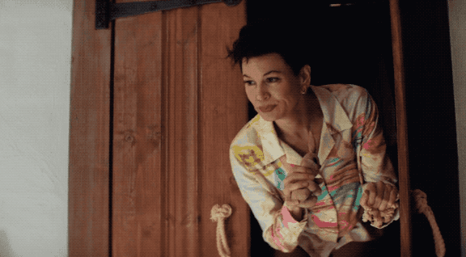

# AUOHP API

## License
This source code is copyright ©2026 The ACT UP Oral History Project, with all rights reserved. Under the GNU Affero General Public License v3.0 or later (AGPL-3.0-or-later), you are granted a license to modify, copy, or redistribute derivative works. Derivative works must also be subject to the terms of the AGPL. Modified source code deployed to a network server must also be released and licensed under the AGPL.
